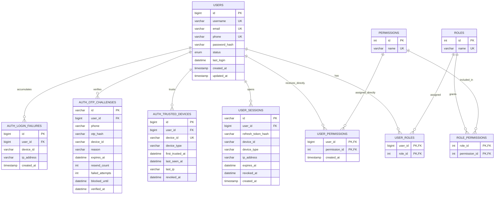
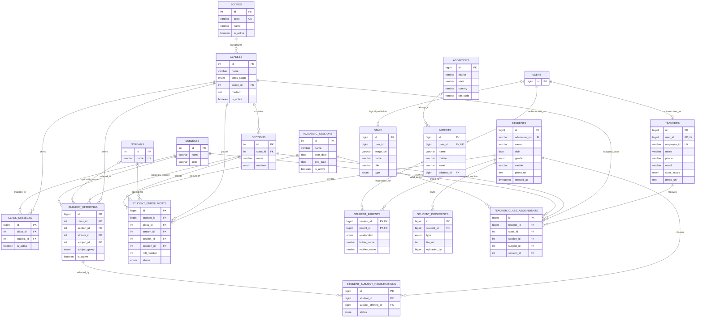
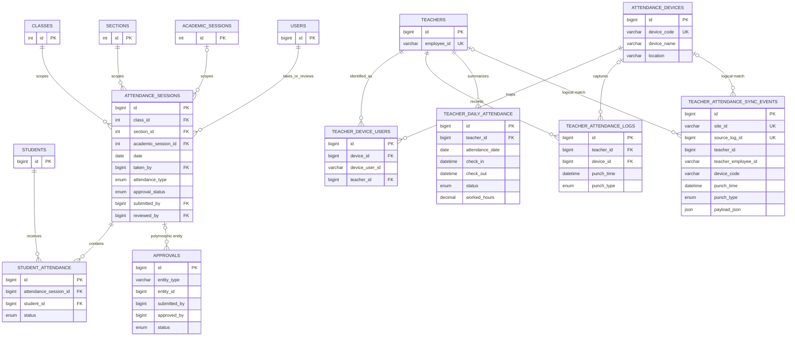
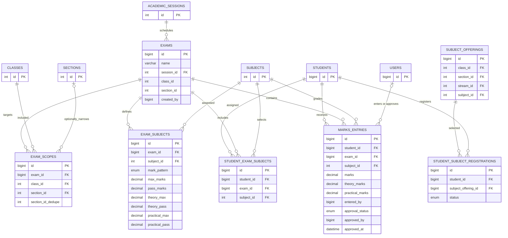
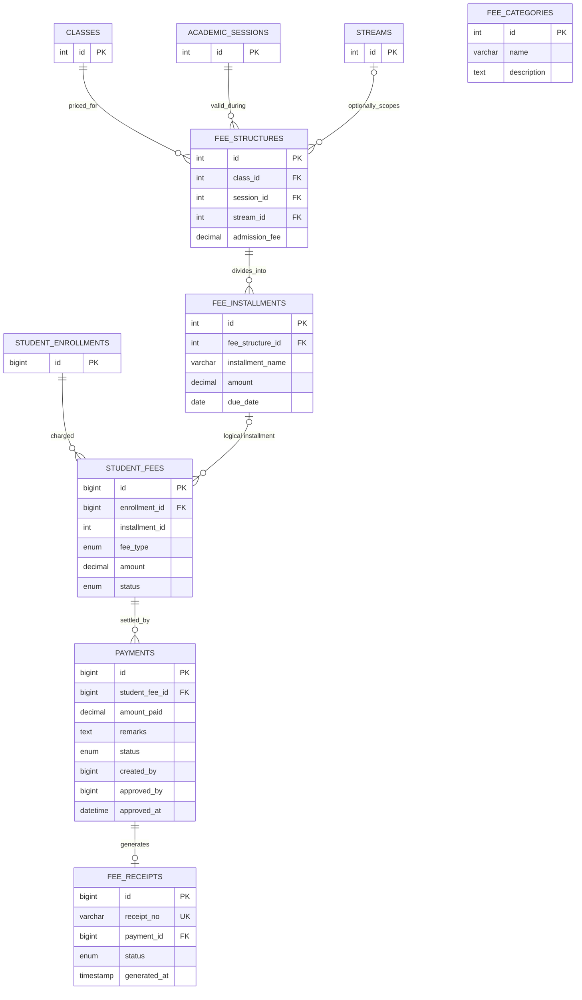
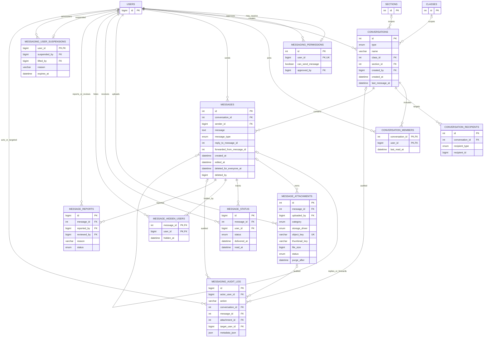
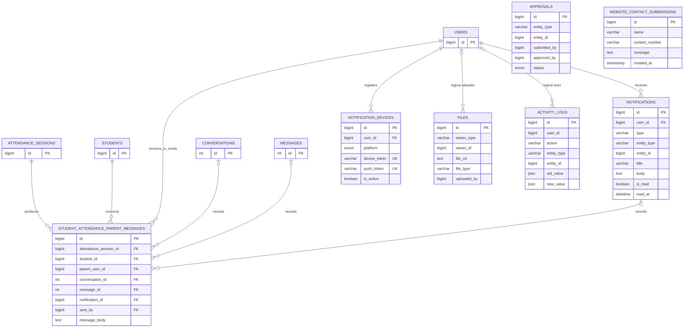

# Full-Stack LMS Entity Relationship Diagrams

This document is derived from the current schema files, migrations, and backend
repository queries. The database is split into domain diagrams because a single
diagram containing every table and relationship is difficult to read.

Legend:

- `PK` — primary key
- `FK` — database or intended foreign key
- `UK` — unique key
- `logical` — a relationship used by application code but not consistently
  enforced by a database foreign-key constraint
- `polymorphic` — a reference identified by an entity type and entity ID

## 1. Identity, Authentication, and RBAC



## 2. Academic Structure and People



## 3. Student and Teacher Attendance



## 4. Exams, Marks, and Reports



## 5. Fees and Payments



`fee_categories` currently exists as reference data but is not linked by a
foreign key to the active fee-structure model.

## 6. Messaging and Media



The `reply_to_message_id`, `forwarded_from_message_id`, and `deleted_by`
columns are logical references in the current migration and do not have
explicit foreign-key constraints.

## 7. Notifications, Attendance Communication, and Generic Audit Records



`approvals`, `notifications`, `files`, and `activity_logs` contain polymorphic
entity references. Their `entity_type`/`entity_id` or `owner_type`/`owner_id`
pairs intentionally cannot be represented as normal foreign keys to one table.

## Important Schema Observations

1. The migration history is the deployment authority. Older SQL snapshots may
   not contain every current column or relationship.
2. `staff.user_id` is used as a user-profile relationship but the migration
   adding it does not create a foreign-key constraint.
3. `student_fees.installment_id` is used as a relationship to
   `fee_installments.id`, but the original schema does not declare its foreign
   key.
4. `teacher_attendance_sync_events` stores source identifiers and resolved
   teacher/device values without foreign keys so external events can be audited
   even when mapping fails.
5. Messaging self-references for replies and forwards are indexed but not
   declared as foreign keys.
6. Generic approvals and audit entities use polymorphic references.
7. Some legacy repository code refers to older names such as
   `parent_students`; the active attendance, user, and messaging flows use
   `student_parents`.
8. `subject_offerings` is the forward path for assigning subjects to a
   class, optional section, and optional stream. Existing `class_subjects`
   remains for backward compatibility and simple class-level subjects.
9. `student_subject_registrations` stores permanent student subject choices.
   Marks and reports use these registrations when present, while existing
   `student_exam_subjects` remains as an exam-specific transition layer.

## Prompt for Generating a Visual ERD

Use this prompt with a diagram-capable AI tool:

```text
Create a professional entity relationship diagram for a production School and
College Learning Management System using MySQL.

Use Crow's Foot notation. Group entities into these colored domains:

1. Identity and RBAC:
users, roles, permissions, user_roles, role_permissions, user_permissions,
user_sessions, auth_trusted_devices, auth_otp_challenges, auth_login_failures.

2. Academic and People:
scopes, academic_sessions, classes, sections, streams, subjects,
class_subjects, students, student_enrollments, addresses, parents,
student_parents, student_documents, teachers, teacher_class_assignments, staff.

3. Attendance:
attendance_sessions, student_attendance, attendance_devices,
teacher_device_users, teacher_attendance_logs, teacher_daily_attendance,
teacher_attendance_sync_events, student_attendance_parent_messages.

4. Exams and Marks:
exams, exam_scopes, exam_subjects, student_exam_subjects, marks_entries.

5. Finance:
fee_categories, fee_structures, fee_installments, student_fees, payments,
fee_receipts.

6. Messaging:
messaging_permissions, conversations, conversation_members,
conversation_recipients, messages, message_attachments, message_status,
message_hidden_users, message_reports, messaging_user_suspensions,
messaging_audit_log.

7. Notifications and Generic Records:
notifications, notification_devices, approvals, files, activity_logs,
website_contact_submissions.

Show primary keys, foreign keys, unique keys, and cardinality. Emphasize these
many-to-many junction tables:
user_roles, role_permissions, user_permissions, class_subjects,
student_parents, teacher_class_assignments, conversation_members,
message_hidden_users, and student_exam_subjects.

Show these core flows prominently:

- users -> roles -> permissions
- students -> enrollments -> class/section/session/stream
- parents <-> student_parents <-> students
- teachers -> teacher_class_assignments -> classes/sections/subjects/sessions
- attendance_sessions -> student_attendance -> students
- attendance_devices -> teacher_device_users -> teachers
- exams -> exam_scopes and exam_subjects -> marks_entries -> students
- fee_structures -> fee_installments -> student_fees -> payments -> receipts
- conversations -> conversation_members and messages -> attachments/status
- users -> notifications and notification_devices

Represent these as logical or dashed relationships because they are not always
enforced by database foreign keys:

- staff.user_id -> users.id
- student_fees.installment_id -> fee_installments.id
- messages.reply_to_message_id -> messages.id
- messages.forwarded_from_message_id -> messages.id
- messages.deleted_by -> users.id
- teacher_attendance_sync_events.teacher_id -> teachers.id
- approvals.entity_type/entity_id -> domain entities
- notifications.entity_type/entity_id -> domain entities
- files.owner_type/owner_id -> domain entities
- activity_logs.entity_type/entity_id -> domain entities

Keep the diagram readable by producing one overview diagram and separate
domain-level detail diagrams. Do not invent tables or relationships that are
not listed.
```
